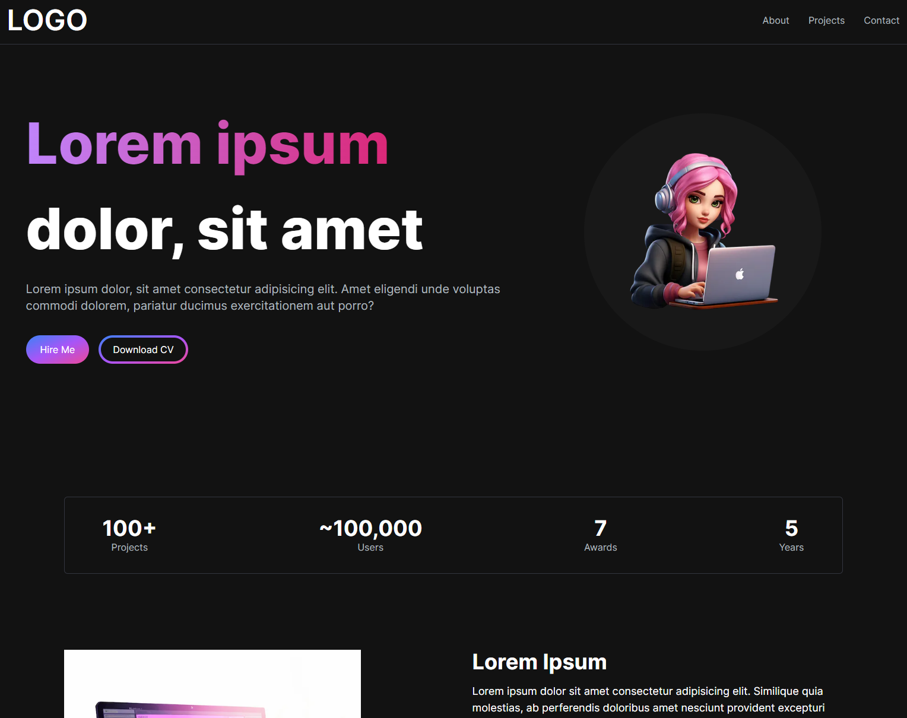

# Portfolio Project



This project is a portfolio site showcasing my skills, experiences, and projects. It's built using Next.js 13, React 18, Framer Motion, and TailwindCSS.

Live Demo: [Portfolio Site](https://portfolio-site-wine-alpha.vercel.app/)

GitHub Repository: [Portfolio Site GitHub](https://github.com/simbolmina/portfolio-site.git)

## Features

- Responsive Design
- Smooth animations using Framer Motion
- Count-up animations using `react-animated-numbers`
- Server-Side Rendering enabled by Next.js
- Highly customizable with TailwindCSS

## Technologies Used

- Next.js 13
- React 18
- Framer Motion 10.16.4
- TailwindCSS 3
- Heroicons 2.0.18

## Local Development

### Requirements

- Node.js v14 or higher
- Yarn or npm

### Installation

1. Clone the repository:

   ```bash
   git clone https://github.com/simbolmina/portfolio-site.git
   ```

2. Navigate into the project directory:

   ```bash
   cd portfolio-site
   ```

3. Install the dependencies:

   ```bash
   npm install
   # or using yarn
   yarn install
   ```

### Running the Development Server

Run the development server with:

```bash
npm run dev
# or using yarn
yarn dev
```

Open [http://localhost:3000](http://localhost:3000) with your web browser to see the result.

### Build and Start

To build and start in production environment:

```bash
npm run build
npm run start
# or using yarn
yarn build
yarn start
```

## Deployment

The app is deployed on Vercel. You can [view the live demo here](https://portfolio-site-wine-alpha.vercel.app/).

## Acknowledgements

This project was inspired by and adapted from the following tutorial:

- [Next.js & TailwindCSS Portfolio Project](https://www.youtube.com/watch?v=Kb1f5bvF6f4)
